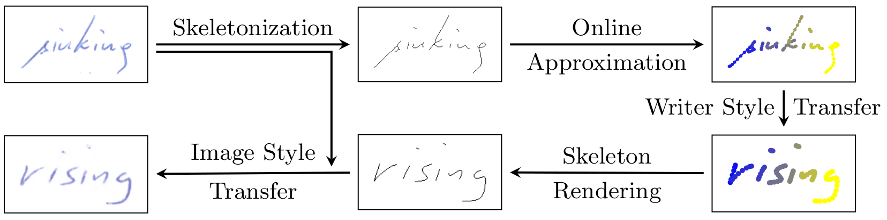

# Spatio-Temporal Handwriting Imitation



Paper Link: https://arxiv.org/abs/2003.10593

## Abstract:

>Most people think that their handwriting is unique and cannot be imitated by machines, especially not using completely new content. 
Current cursive handwriting synthesis is visually limited or needs user interaction.
We show that subdividing the process into smaller subtasks makes it possible to imitate someone's handwriting with a high chance to be visually indistinguishable for humans.
Therefore, a given handwritten sample will be used as the target style. 
This sample is transferred to an online sequence. Then, a method for online handwriting synthesis is used to produce a new realistic-looking text primed with the online input sequence. This new text is then rendered and style-adapted to the input pen. We show the effectiveness of the pipeline by generating in- and out-of-vocabulary handwritten samples that are validated in a comprehensive user study. Additionally, we show that also a typical writer identification system can partially be fooled by the created fake handwritings.

tldr: Imitating someone's handwriting by converting it to the temporal domain and back again

## Requirements

See requirements.txt

## Run the full pipeline

Before running the pipeline the trained model checkpoints have to be copied into the folder _checkpoints_ from https://drive.google.com/open?id=11fc8b7QTSqL8oIjs7ddGutlRKEL8NBqh.

```bash
pip3 install --user gdown
gdown https://drive.google.com/uc?id=11fc8b7QTSqL8oIjs7ddGutlRKEL8NBqh
unzip checkpoints.zip
#rm checkpoints.zip # if you need space
```

To run the pipeline see __demo.sh__. 


## Download CVL
```bash
wget https://zenodo.org/record/1492267/files/cvl-database-cropped-1-1.zip?download=1
mv 'cvl-database-cropped-1-1.zip?download=1' cvldb.zip
mkdir -p data/cvl
cd data/cvl
unzip ../../cvldb.zip
```
##Download json file
https://drive.google.com/file/d/1_XMeHVb6brvjGFWQrhdTC-L3KGuvFRN1/view?usp=sharing


## Code contribution

The code was mainly produced by https://github.com/Finomnis

## External sources

Link: https://github.com/junyanz/pytorch-CycleGAN-and-pix2pix
Link: https://github.com/sjvasquez/handwriting-synthesis


## Hello World
How to render if you have the pretrained models

TODO (qiang) polish these up
```bash
PYTHONPATH='./' ./tools/run_generator.py  -input ./docs/img/input.png -text_in 'above or sinking bellow' -text_out 'hello world'
```

```bash
#!/bin/bash

SCRIPTPATH=$( cd $(dirname $(readlink -f $0)) ; pwd -P )

export PYTHONPATH=$PYTHONPATH:"$SCRIPTPATH"

python3 "$SCRIPTPATH/tools/full_pipeline.py" \
       "$SCRIPTPATH/docs/img/input.png" \
       --text-in "above or sinking below" \
       --text-out "hahah nihao"

```

while developing PYTHONPATH should be
```bash
PYTHONPATH='./:./thirdparty/wi_19/:' 
```
